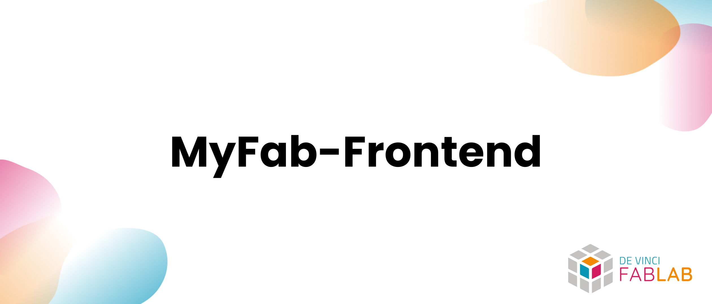

## Overview

> Frontend repository of the MyFab project.

This repository contains the frontend of the MyFab project as well as its documentation and components. The frontend is built using SvelteKit and TailwindCSS.

## Getting Started

- [Overview](#overview)
- [Getting Started](#getting-started)
  - [Documentation](#documentation)
  - [Supported languages](#supported-languages)
  - [Roadmap for future improvements](#roadmap-for-future-improvements)
  - [Contributing](#contributing)
  - [License](#license)

### Documentation

The frontend documentation is available [here](https://github.com/DeVinci-FabLab/MyFab-Frontend/blob/main/docs/index.md).

### Supported languages

- English 🇬🇧
- French 🇫🇷 [partial]

### Roadmap for future improvements

[Insert the project link here]

### Contributing

If you want to contribute to the project, please read the [CONTRIBUTING](./.github/CONTRIBUTING) file and contact the project manager.

### License

This project is licensed under the MIT License - see the [LICENSE.md](./LICENSE) file for details.
